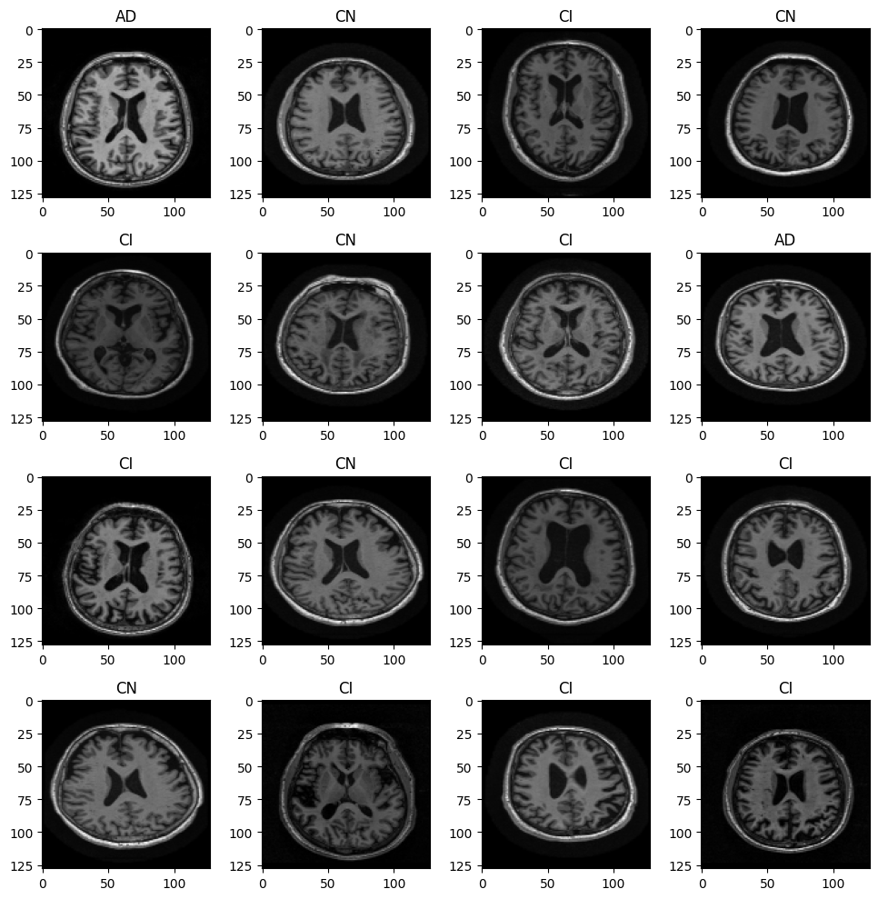
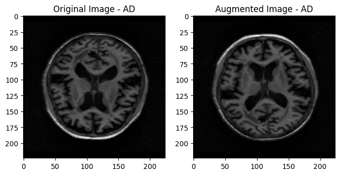
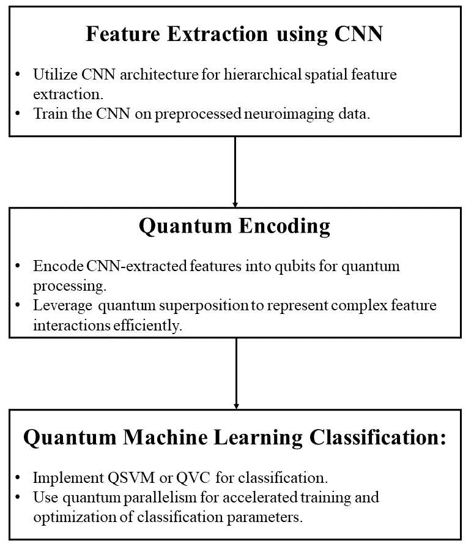

# CSE3042-JComp
This repository contains the code and other requirements for Alzheimer's Prediction using Quantum Neural Networks

## Abstract
This project explores the transformative potential of Quantum Support Vector Machines (QSVM) in the domain of Alzheimer's disease prediction, leveraging the unique properties of quantum computing. The study investigates the efficacy of QSVM in comparison to classical algorithms, showcasing the advantages derived from quantum parallelism, superposition, and entanglement. Through extensive evaluations, our research highlights the robust performance of QSVM in feature extraction and dimensionality reduction, crucial aspects in neurodegenerative disease prediction. The model's interpretability, achieved through quantum explainability tools, addresses concerns related to the transparency of quantum algorithms. While presenting promising results, we acknowledge challenges such as hardware dependency and sensitivity to noise. This work contributes to the growing intersection of quantum computing and healthcare analytics, pointing toward a future where quantum algorithms play a pivotal role in advancing predictive models for Alzheimer's disease and similar medical applications.

## Materials and Methods
#### 1. Data
In this project, we used public brain MRI data from **Alzheimers Disease Neuroimaging Initiative (ADNI)** Study. ADNI is an ongoing, multicenter cohort study, started from 2004. It focuses on understanding the diagnostic and predictive value of Alzheimers disease specific biomarkers. The ADNI study has three phases: ADNI1, ADNI-GO, and ADNI2. Both ADNI1 and ADNI2 recruited new AD patients and normal control as research participants. Our data included a total of 4854 structure MRI scans in Axial view, with 1124 AD cases, 1140 MCI cases and 2590 normal controls.

#### 2. Image preprocessing
The MRI images obtained from the ADNI dataset were pre-processed prior to being fed to the CNN model for feature extraction. Input shape of the images was set to be (224,224) akin to VGG-16s input layer.  The MRI images are then converted to grayscale for simplification, consistency, and enhanced interpretability. Grayscale representation reduces the image to a single intensity channel, facilitating the implementation of image processing algorithms with reduced computational complexity. Grayscale images also provide improved contrast, making them suitable for visualizing specific anatomical details or abnormalities. Min-Max normalization is also applied to scale pixel values between 0 and 1, ensure consistent scale and mitigate intensity variations.

#### 3. Data Augmentation
Data augmentation serves as a pivotal preprocessing step in the analysis of medical images, encompassing diverse transformations like flips or rotations to artificially amplify dataset diversity. The significance of this augmentation lies in its capacity to bolster the resilience and generalization of machine learning models, particularly when trained on limited datasets. By introducing variations within the training set, augmented data aids the model in effectively capturing the inherent variability in medical images, thereby mitigating overfitting and enhancing the model's performance on previously unseen data. In the realm of MRI images, data augmentation plays a crucial role in advancing the development of robust and accurate models, particularly for tasks such as disease classification or segmentation, where challenges stemming from variations in patient positioning and imaging conditions are prevalent.

#### 3. Proposed Methodology
In the proposed methodology, Convolutional Neural Networks (CNNs) are employed for feature extraction from MRI images, leveraging a pre-trained model such as VGG16. To adapt the CNN to the specific characteristics of brain images, a fine-tuning process is undertaken on the dataset. Subsequently, quantum feature encoding techniques are explored to represent the CNN-extracted features in a quantum state. This involves investigating methods like amplitude encoding, quantum embeddings, and other quantum feature maps to encode relevant information. Moving forward, a Quantum Support Vector Machine (QSVM) is implemented using a quantum computing library, such as Qiskit. The quantum states obtained from the preceding step are encoded as inputs to the QSVM, which is then trained on the encoded features for the three classes—Alzheimer's Disease (AD), Mild Cognitive Impairment (MCI), and Normal Control (NC). This integrated approach aims to harness the strengths of classical and quantum methods for enhanced accuracy in classifying Alzheimer's disease stages from MRI data.

